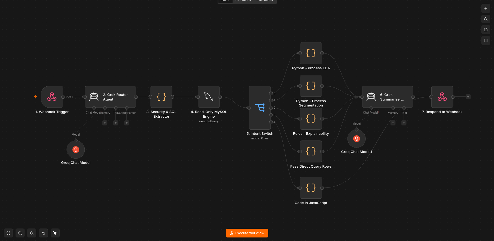

<div align="center">

# TRESOR

### Customer Segmentation & Intelligence AI — Retail Banking

**An AI-powered, intent-routed agent that performs exploratory data analysis, customer segmentation, persona generation, and explainability over a retail bank's credit card portfolio — deployed as a fully self-contained, one-command Docker stack.**

[](http://YOUR-SERVER-IP/)

</div>

---

## Problem Statement

A retail bank offers savings accounts, credit cards, personal loans, and investment products, but currently applies broad, one-size-fits-all marketing — leading to low engagement and weak product adoption. The bank wants to use its own customer data to understand behavioral patterns, segment customers into meaningful groups, and deliver personalized recommendations.

**Objective.** Design an agent that:
1. Performs automated EDA on customer data
2. Segments customers by behavioral and financial attributes
3. Generates interpretable customer personas
4. Recommends personalized banking products/strategies per segment
5. Produces human-readable insights and summaries
6. Simulates how a bank's analytics team would derive insights with minimal manual intervention

**Minimum functional requirements covered by this system:** natural-language chat interface, dynamic EDA, rule-based segmentation, explainability (why a customer belongs to a segment), and human-readable summarization — all driven by a single conversational entry point rather than separate dashboards/tools.

---

## Architecture

```
User (browser)
      │
      ▼
 [nginx:80] ── serves index.html, reverse-proxies /webhook/* to n8n
      │
      ▼
 [n8n:5678] ── the agent pipeline (see below)
      │
      ▼
 [MySQL] ── cc_general table (credit card portfolio dataset)
```

<p align="center">
  
  <br/>
  <em>Fig 1. The complete n8n workflow — route, execute, filter, summarize.</em>
</p>

### The Pipeline, Node by Node

| # | Node | Job |
|---|------|-----|
| 1 | **Webhook Trigger** | Receives the user's natural-language query over POST |
| 2 | **Grok Router Agent** | Classifies intent (`DIRECT_QUERY`, `EDA`, `EXPLAINABILITY`, `SEGMENTATION`, `UNSUPPORTED`) and writes the exact SQL needed to answer it |
| 3 | **Security & SQL Extractor** | Parses the router's JSON, strips markdown fencing, blocks any write-operation SQL (`DROP`/`DELETE`/`UPDATE`/etc.), degrades gracefully to `UNSUPPORTED` instead of crashing on malformed output |
| 4 | **Read-Only MySQL Engine** | Executes the generated `SELECT` against `cc_general` |
| 5 | **Intent Switch** | Routes the raw SQL result to one of 5 branches based on intent |
| 6a–6d | **Intent-specific Filter Nodes** | Trim/round/prune the raw rows down to only what's needed (see **Token Optimization**) |
| 7 | **Grok Summarizer Agent** | Turns the filtered data into a plain-language answer, tailored per intent |
| 8 | **Respond to Webhook** | Returns `{ summary, intent, data }` as JSON |

**Why intent classification first, not one big prompt?** A single LLM call trying to both understand the question *and* reason over the full 18-column dataset *and* write a good final answer is slow, expensive, and error-prone. Splitting it into **route → execute → filter → summarize** means each LLM call has one narrow job, gets only the data it actually needs, and can be swapped/tuned independently.

---

## How Intent Is Decided

The router (Node 2) classifies every incoming query into one of five intents using a strict priority hierarchy. A semantic synonym bridge in the same prompt maps colloquial phrasing ("money", "richest", "borrowed", "paid off") onto exact schema columns, so the router doesn't need the user to know column names.

| Intent | Trigger Rules | Example Queries | Router Output |
|--------|--------------|-----------------|---------------|
| **DIRECT_QUERY** | Any request asking for ordered records, rankings, limits, or specific filtered lists. *(Always takes priority over EDA.)* | _"Top 5 customers by purchases"_, _"Show customers with balance > 5000"_ | Writes SQL with `ORDER BY` and `LIMIT 10`. |
| **EDA** | Portfolio-level summary statistics (averages, totals, counts, min/max). Must **not** request a ranked list of individual users. | _"What is the average credit limit?"_, _"Give me a summary of total payments"_ | Writes aggregate SQL using `AVG()`, `SUM()`, `COUNT()`, etc. |
| **EXPLAINABILITY** | Questions targeting a specific customer ID to analyze or explain their financial behavior. | _"Audit customer C10012"_, _"Why does C10005 have a low full payment rate?"_ | Writes SQL pulling data for that specific `WHERE CUST_ID = '...'`. |
| **SEGMENTATION** | Requests to divide, group, or segment the overall portfolio into behavioral personas. | _"Segment the portfolio"_, _"Group customers based on spending and payments"_ | Writes SQL pulling all 8 core behavioral columns (`BALANCE`, `PURCHASES`, `CREDIT_LIMIT`, etc.) for clustering downstream. |
| **UNSUPPORTED** | Anything outside the retail banking dataset, **or** requests trying to perform write operations (`DROP`, `DELETE`, `UPDATE`). | _"What's the weather in Chennai?"_, _"Delete table cc_general"_ | Directly returns a fixed refusal string without running database queries or downstream LLMs. |

---

## Token Optimization — Why This Is Fast and Cheap

The naive approach — dump the full SQL result straight into the summarizer — wastes tokens on noise the model doesn't need and slows every response down. Instead, each intent gets its own purpose-built filter before it ever reaches an LLM:

| Intent | Problem with Raw Output | Filter Applied |
|--------|------------------------|----------------|
| **DIRECT_QUERY** | `SELECT *` style results return 10 rows × 18 columns — thousands of tokens of mostly irrelevant fields | Hard-capped to 10 rows, pruned to only `CUST_ID` + the relevant metric column(s), floats rounded to 2 decimals |
| **EDA** | Aggregates come back with long float precision (`1564.474829101...`) | All rows kept (usually 1–3 aggregate rows anyway), every number rounded to 2 decimals — payload is typically under 100 tokens |
| **EXPLAINABILITY** | A full customer profile pull returns all 18 columns, many zero/null | Capped to 1–2 rows, every zero/null/empty field stripped so the model only reads fields with actual signal |
| **SEGMENTATION** | Arbitrary column selection risks single-dimension reasoning | Capped to 10 rows, pruned to exactly the 5 core behavioral columns, floats rounded |
| **UNSUPPORTED** | N/A — no data needed at all | Zero SQL reasoning wasted on the summarizer; a static response is returned directly, skipping the LLM call completely |

**Net effect:** every query pays only for the tokens its answer actually needs. A ranking question never drags along 14 irrelevant columns; a portfolio-average question never repeats itself 50 times; an unsupported question costs nothing beyond the router's classification call. This is also what keeps response latency low and predictable — the summarizer is never reasoning over more data than the question calls for.

---

## Deployment — One Command, Fully Self-Configuring

### Repo Structure

```
project/
├── docker-compose.yml
├── .env.example
├── entrypoint.sh          (auto-imports n8n workflow + credentials on first boot)
├── init.sh                (auto-creates cc_general table + loads dataset.csv on first boot)
├── nginx.conf              (serves frontend, reverse-proxies /webhook/* to n8n)
├── dataset.csv
├── workflow.json
└── index.html
```

### 1. Clone and Configure

```bash
git clone <this-repo-url>
cd <repo-folder>
cp .env.example .env
```

### 2. Generate an Encryption Key

n8n (self-hosted, free/open-source — no enterprise license needed) requires an encryption key to store credentials securely in its local database. Generate one and paste it into `.env`:

```bash
openssl rand -hex 32
```

Copy the output into `.env` as:
```
N8N_ENCRYPTION_KEY=<paste the generated string here>
```

### 3. Fill in the Rest of `.env`

```env
MYSQL_ROOT_PASSWORD=root123
MYSQL_DATABASE=bank_db
MYSQL_USER=user
MYSQL_PASSWORD=pass123

N8N_ENCRYPTION_KEY=<from step 2>

WEBHOOK_URL=http://<your-server-ip>:5678/

GROQ_API_KEY=<your Groq API key>
```

`WEBHOOK_URL` is the only value that changes per deployment — set it to whatever public/server IP the box actually has.

### 4. Bring the Whole Stack Up

```bash
docker compose up -d
```

That single command:
- Spins up **MySQL**, auto-creates the `cc_general` table, and bulk-loads `dataset.csv` into it (first boot only)
- Spins up **n8n**, auto-imports `workflow.json` and the MySQL/Groq credentials, and auto-activates the workflow (first boot only)
- Spins up **nginx** serving `index.html` on port 80, reverse-proxying `/webhook/*` straight to n8n internally — so the browser never needs CORS configuration at all

### 5. Verify

```bash
docker compose logs -f n8n     # look for "==> Import complete"
docker compose logs -f mysql   # look for "==> cc_general loaded from dataset.csv"
docker ps                      # should show 3 running containers: mysql, n8n, frontend
```

Then open `http://<your-server-ip>/` in a browser.

Re-running `docker compose up -d` after the first boot is safe — both `entrypoint.sh` and `init.sh` check for a flag/existing table before doing any import work, so nothing gets duplicated or re-loaded on restart.

---

## Why This Architecture

- **Fast** — each LLM call is narrow-scoped (route, then summarize); no single call reasons over the full dataset or the full conversation.
- **Efficient / Cost-Optimized** — intent-based filtering means every response pays only for the tokens its specific answer needs; `UNSUPPORTED` requests skip the summarizer LLM call entirely.
- **Dynamic** — the same pipeline handles rankings, aggregates, customer audits, and segmentation from one natural-language entry point, without the user needing to know SQL or column names.
- **Safe by Construction** — write-operation SQL is blocked before execution, not after; malformed model output degrades gracefully instead of crashing the pipeline; unsupported requests get a fixed, predictable response instead of an improvised one.
- **Reproducible** — the entire stack, data, and workflow configuration come up identically from a single command on any machine, with no manual UI clicking required.

---

## Known Issues / Fixes Applied

- **Segmentation returning single-column reasoning** — the router previously had no explicit SQL mandate for the `SEGMENTATION` intent, so it would arbitrarily pick columns (observed: only `PURCHASES`, ignoring `BALANCE`/`CREDIT_LIMIT`/`PAYMENTS`). Fixed by adding an explicit SQL mandate forcing all 5 core columns (`CUST_ID`, `BALANCE`, `PURCHASES`, `CREDIT_LIMIT`, `PAYMENTS`) on every segmentation query, plus a matching few-shot example in the router's system prompt.

---

## Tech Stack

| Layer | Technology |
|-------|-----------|
| Frontend | HTML / CSS / Vanilla JS |
| Reverse Proxy | nginx |
| Orchestration | n8n (self-hosted, open-source) |
| LLM | Groq API (Llama 3) |
| Database | MySQL 8 |
| Deployment | Docker Compose |

---

<div align="center">

**Built for the hackathon. Designed to scale.**

</div>
